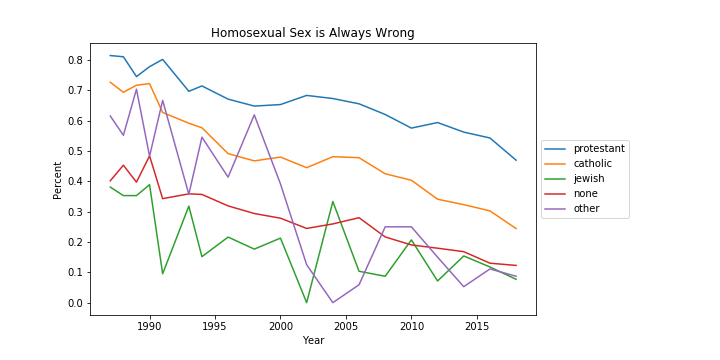
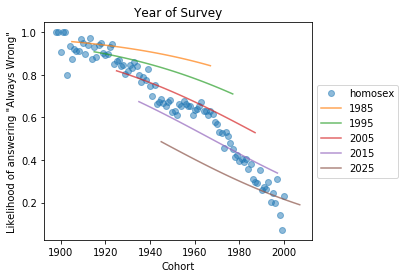

# Analysis of Opinions on Same-Sex Relations

Ariana Olson, Emma Price

## Overview

Public opinion of same-sex relations has changed dramatically in recent years. What was in recent memory something that most people considered to be "always wrong" is now considered by most people to be "always right." This raises the question of how public opinion has changed. Have younger people, who did not experience the AIDs crisis and have grown up with gay role models sufficiently shifted how public opinion appears? Has everyone become less disapproving of same-sex relations overtime? Are young people consistently more accepting and then grow less so as they age? As well, how do demographics like sex, income, location, and religion effect this change in public opinion?

Our full analysis can be found [on github](https://github.com/arianaolson419/ThinkStats2/blob/master/project2/project2.ipynb)

## The General Social Survey Dataset

The General Social Survey, or GSS, is one of the most frequently analyzed data sets in the social sciences. According to the [About page of the GSS website says](https://gssdataexplorer.norc.org/pages/show?page=gss%2Fabout),

> The General Social Survey (GSS) is a project of NORC at the University of Chicago, with principal funding from the National Science Foundation. Since 1972, the GSS has been monitoring societal change and studying the growing complexity of American society.

The codebook for the GSS can be found [here](https://gssdataexplorer.norc.org/documents#doc_441) It provides detailed information about the survey design and variables in the dataset.

### About the Survey

For more detailed information about the GSS, please refer to the [codebook introduction](https://gssdataexplorer.norc.org/documents/463/display). 

The GSS is administered to an independently drawn sample of English speaking (and Spanish speaking after 2006) people over the age of 18 and living in non-institutional arrangements in the United States. Several sampling methods have been used throughout the years that the GSS has been administered. These include 

Block quota sampling was employed in earlier survey years (1972-4) and full probability sampling was used in half of the 1975 and 1976 surveys and all subsequent surveys.

Until 2000, the survey was administered with paper and pencil. From 2002 onward, the survey was conducted using computer-aided personal interviewing.

The terms of use for using the GSS data are given in full [on their website](https://gssdataexplorer.norc.org/pages/show?page=gss%2Fterms). Key points from these terms are that the data, software, and documentation will be used responsibly, and that the data is offered "as is" with no guarantee of completeness, accuracy, or fitness for a particular purpose.

### Descriptions of Key Variables Used in Analysis
#### `homosex`
The `homosex` variable represents how wrong a respondent thinks homosexual sex is. It has been consistently included in every GSS since 1987. The question posed to survey takers is: " What about sexual relations between two adults of the same sex--do you think it is always wrong, almost always wrong, wrong only sometimes, or not wrong at all?" The response choices are as follows:
- Always wrong
- Almost always wrong
- Wrong only sometimes
- Not wrong at all
- Other
- Don't know

For this analysis, we focus only on respondents who answered "Always wrong" or "Not wrong at all".

#### `year`
The `year variable represents the year the respondent took the survey.

#### `cohort`
The `cohort` variable represents the birth cohort of the respondent, or the range of birth years they belong to.

#### `age`
The `age` variable represents the age of the respondent at the time they took the survey. Respondants are ages 18 and older.

#### `reg16` and `region`

`reg16` represents the region that the respondent lived in at age 16 and `region` represents the region in which the repondent took the survey. Both of these group US states in the same way. These regions are as follows: 

- New England = Maine, Vermont, New Hampshire, Massachusetts, Connecticut, Rhode Island
- Middle Atlantic = New York, New Jersey, Pennsylvania
- East North Central = Wisconsin, Illinois, Indiana, Michigan, Ohio
- West North Central = Minnesota, Iowa, Missouri, North Dakota, South Dakota, Nebraska, Kansas
- South Atlantic = Delaware, Maryland, West Virginia, Virginia, North Carolina, South Carolina, Georgia, Florida, District of Columbia
- East South Central = Kentucky, Tennessee, Alabama, Mississippi
- West South Central = Arkansas, Oklahoma, Louisiana, Texas
- Mountain = Montana, Idaho, Wyoming, Nevada, Utah, Colorado, Arizona, New Mexico
- Pacific = Washington, Oregon, California, Alaska, Hawaii

## Analysis
### Age-Period-Cohort
Generational analysis of public opinion can be broken down to look into period effect, cohort effect (effects due to the year that the respondent was born), and age effect (effects due to respondents aging). Completing an age-period-cohort analysis on the public opinion of same-sex relations allows us to identify which of those three items drives the change.

#### Period Effect
Period effects appear as changes across the respondents regardless of whatever groups they are broken down by, but not necessarily to the same amount.
##### Grouped by Age
Below are the graphs of the average disapproval and approval of same-sex relations each year within each age group. Across each year, all of the age groups are becoming more accepting of same-sex relations; however, the exact rate of change definitely varies across groups. Specifically, people who were in their 70s and 80s have a lower rate of change -- moving from about 10% to 20% and 30% accepting for people in their 70s and 80s, relatively. Comparatively, people who were in their 20s moved from 15% to 70% accepting, which is more than double that of older people. From these graphs there seems to be a period effect.

##### Grouped by Cohort
Below are the graphs of the average disapproval and approval of same-sex relations each year within each birth decade. These plots are very similar to those in seen when grouped by age, but across all groups there is less change across all groups, each line is a little more flat and they move together a little more consistently. Indicating a period effect.

#### Cohort Effect
Below is a graph of average opinion on same-sex relations within each birth year to check for a cohort effect. There is a definite, consistent in crease in people who approve of same-sex relation and decrease in people do disapprove as people are born in more recent years. This indicates a cohort effect.

#### Age Effect
Age effects indicate that there are differences across generations regardless of cohort and survey year. Age effects appear as changes where all groups move together.
##### Grouped by Year
The graphs below plot the average opinion toward same-sex relations for each age of each seven year grouping. In the same-sex relations is never wrong graph there is a fairly consistent decrease for all ages, but the changes do not move at the same rate within the different 7-year groups. Within the same-sex relations are always wrong graph, the percentages vary in a really inconsistent way across ages from year-to year. $$$$$$$$$$$$$$$$$$$$$

##### Grouped by Cohort
Below are the graphs of the average percentage of disapproval (left) and approval (right) of same-sex relations within birth decade, and plotted against the age that the respondents were when they took the survey. Across the decade $$$$$$$$$$$$$$$$$$$$$$$$$$$$$$$$$$

### Logistic Regression

To better understand the trends in the data, we create a logistic regression model using a handful of variables that we determined influenced whether or not a respondent thought that homosexual sex was wrong or not. The model predicts the likelihood that a respondent thinks that homosexual sex is always wrong. In making this model, we only take into consideration respondents who answered 'Not Wrong at All' or 'Always Wrong'. This is because we need to model a binary choice. It is worth noting that the majority of respondents who answered this question gave one of these two answers.

The explanatory variables we are using in this model are:

1. `year`: The survey year.
2. `cohort`: The year the respondent was born in.
3. `sex`: The sex of the respondent.
4. `reg16`: The region the respondent lived in when they were 16.
5. `relig`: The respondent's religion.
6. `attend`: The frequency with which the respondent attends religious services.

We are using these variables to capture several trends that we found during variable exploration.

#### Religion
We will first look at how the religion of the respondent influenced the likelihood that they would believe homosexual sex was always wrong. Shown below are plots of the proportions of "Always Wrong" and "Not Wrong at All" answers for each survey year, grouped by the religion of the respondent. Only the top 5 most popular religious groups are shown because the less popular religious groups may cotain fewer than 20 respondents per year, as opposed to over 200 for the popular groups.

There is a fairly clear stratification of proportions among the religious groups, which indicates that religion could be a fairly significant predictor of how a person feels about homosexual sex. Aside from the "Other" group, which may include a disproportionally varied group of respondents, the groups all maintain a relative ranking with Protestants having the highest proportion of "Always wrong" and the lowest proportion of "Not wrong at all" answers, while the opposite is true for the Jewish group. All of the proportions of "Always wrong" answers decrease with time, while all of the proportions of "Not wrong at all" answers increase with time.

We expect to see in the model that Protestant and Catholic respondents are most likely to say that homosexual sex was always wrong, and that Jewish respondents are least likely to answer this way. This is based on the answers for each group in the GSS data.

For this analysis, we generate predictions for each of the 5 most popular religions that respondents reported in the GSS over a range of survey years. These religions are Protestant, Catholic, Jewish, "Other", and "None". All other explanatory variables are held constant. The plot below shows the results.

As expected, the model predicts that Protestants are most likely to say that homosexual sex is always wrong while Jewish respondents are least likely. The trend for all groups is negative as year increases. The differences in likelihoods among groups stays fairly consistent year to year, except when the likelihoods approach the asymptotes of 1.0 and 0.0.

#### Region

We also want to see if the region respondents reported living in at the age of 16 influenced their opinion on homosexual sex. Shown below are plots of the proportion of respondents who think homosexual sex is always wrong and who think that homosexual sex is never wrong. The respondents are grouped by their responses to `reg16`, and the proportions are plotted by survey year.

For all region groups, the proportion of people who answered "Always Wrong" decreases as the survey year increases, and the proportion of people who answered "Not Wrong at All" increases with survey year. However, the region groups are distinct, and the difference in proportion among groups is fairly constant. New England has both the lowest proportion of "Always Wrong" responses and the highest proportion of "Not Wrong At All" responses. The opposite is true for East South Central (Kentucky, Tennessee, Alabama, Mississippi).

In our predictive model, we expect to see the relative likelihoods of each region to answer "Always Wrong" for `homosex` to be similar in ranking to the proportion of "Always Wrong" responses in the data set. We want to see if the model predicted any notable trends that are more difficult to see in the raw data. The predictions for each region are shown below.

As expected, the relative likelihoods for each region mirror their proportions in the raw data. Except around the asymptotes (when the likelihoods are close to 0 or 1), the regions do not seem to be converging or switching in rank over the years. This makes sense based on the raw data. As the years increase, all of the regions become less likely to answer "Always Wrong".

#### Frequency of Attendance of Religious Services

We also want to see if how often respondents attend religious services influences their answers to `homosex`. The frequency with which a person attends religious services can be used as a rough metric for how religious they are, which is why we are interested in this variable. This variable is independent of the specific religion a person reported. We expect to see that the higher frequency groups would have higher proportions of people who answered "Always Wrong" and the lowest proportions of people who answered "Not Wrong at All". Below are the plots of the proportions of each of these groups by survey year.

As expected, the proportions of respondents who answered "Always Wrong" in each group are ordered from most frequent to least frequent, and the opposite is true for the proportions of respondents from each group that answered "Not Wrong at All". Again, like in the previous variables examined, all proportions of "Always Wrong" answers decrease with time, and all proportions of "Not Wrong at All" answers increase over time. The most notable group is the group that attends services more than once a week. The difference in proportions between this group and the next closest group is much greater than the difference among any other adjacent groups. Additionally, this group never overlaps with another for either answer. Finally, the magnitude of the rate of change is less than the other groups. This tells us that by this one metric, very religious people are much more likely to disapprove of homosexual sex and are slower to change their opinions.

To see how this variable affects the predictive model, we run the model for each group over a range of years while holding the other explanatory variables constant. The plot of these predictions is shown below.

Although the difference in likelihood from the most frequent attenders to the next most frequent is much smaller in the model, there is a very large difference between these two groups and the next most frequent. The rankings in likelihood match the rankings in proportion by year, and all of the groups have a negative trend with time. The effect of the most frequent attending group may be more pronounced in the model if the other explanatory variables were held to different constant values that correspond more with who is most likely to be more religious.

#### Survey Year

Finally, we want to see how the model predicts responses based on the year the survey was taken. Because it was apparent in the Age-Period-Cohort section that the year the survey was taken strongly influences the proportion of respondents who disapprove of homosexual relationships, we want to see if the model agrees. We model predictions for a selection of years from 1970 to 2030. These predictions can be seen below, plotted against cohort. The predictions are only plotted for cohorts that are feasible for the year the survey was taken.

Each year group is less likely to answer "Always Wrong" than the one before it. Additionally, there is a negative trend as the cohort increases. These results are both expected based on earlier findings. It appears that the rate of decrease gets larger for higher years.

## Conclusion

We find from this analysis that both the year the survey was taken by a respondent and the year that they were born have large effects on their opinion of same-sex relations. TODO something about age$$$$$$$$$. 

Additionally, we find that there are a number of demographic variables that can also be used to predict opinions of same-sex relations. A person's age, religion, place where they live, and frequency of religious service attendance all influence their likelihoods of dissaproving of same-sex relations.

It is encouraging that within each demographic variable that we analyzed, the trend is that dissaproval of same-sex relations is decreasing with time. We hope that this trend is an indicator of a general increase of acceptance, and that this trend continues into the future.

Social issues are complex, particularly topics that cross social, political, and religious boundaries. Although our predictive model is useful for highlighting interesting demographic trends and unpacking some of the complexity of this topic, it is very important to remember that this should not be used to pass jusdgement on a person based on their demographics. People vary in their demographic groups, and applying a blanket assumption about what they believe can be damaging and incorrect.
