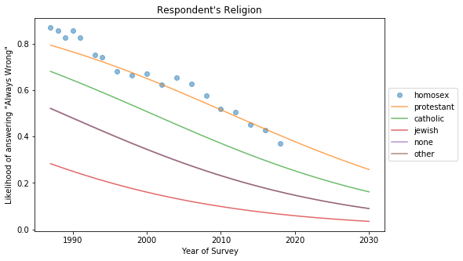

# Analysis of Opinions on Same-Sex Relations

Ariana Olson, Emma Price

## Overview

- motivating question

## The General Social Survey Dataset

The General Social Survey, or GSS, is one of the most frequently analyzed data sets in the social sciences. According to the [About page of the GSS website says](https://gssdataexplorer.norc.org/pages/show?page=gss%2Fabout),

> The General Social Survey (GSS) is a project of NORC at the University of Chicago, with principal funding from the National Science Foundation. Since 1972, the GSS has been monitoring societal change and studying the growing complexity of American society.

The codebook for the GSS can be found [here](https://gssdataexplorer.norc.org/documents#doc_441) It provides detailed information about the survey design and variables in the dataset.

### Sample Design

- collection methods
- variables we used
- any choices we made about excluding certain categories

### Variables used in Analysis
#### `homosex`
#### `year`
#### `cohort`
#### `age`
#### `reg16`
- New England = Maine, Vermont, New Hampshire, Massachusetts, Connecticut, Rhode Island
- Middle Atlantic = New York, New Jersey, Pennsylvania
- East North Central = Wisconsin, Illinois, Indiana, Michigan, Ohio
- West North Central = Minnesota, Iowa, Missouri, North Dakota, South Dakota, Nebraska, Kansas
- South Atlantic = Delaware, Maryland, West Virginia, Virginia, North Carolina, South Carolina, Georgia, Florida, District of Columbia
- East South Central = Kentucky, Tennessee, Alabama, Mississippi
- West South Central = Arkansas, Oklahoma, Louisiana, Texas
- Mountain = Montana, Idaho, Wyoming, Nevada, Utah, Colorado, Arizona, New Mexico
- Pacific = Washington, Oregon, California, Alaska, Hawaii
#### ...
#### ...
#### ...
#### ...

## Analysis
### Age-Period-Cohort

- Graphs of opinion vs year, vs cohort, etc
- Any interesting other graphs that add to argument

Emma does:
- Group by C, plot by A
- Group by A, plot by P
- Group by P, plot by C

### Logistic Regression

To better understand the trends in the data, we created a logistic regression model using a handful of variables we determined influenced whether or not a respondent thought that homosexual sex was wrong or not. The model predicts the likelihood that a respondent thinks that homosexual sex is always wrong. In making this model, we only took into consideration respondents who answered 'Not Wrong at All' or 'Always Wrong'. This is because we needed to model a binary choice. It is worth noting that the majority of respondents who answered this question gave one of these two answers.

The explanatory variables we chose to use in this model are:

1. `year`: The survey year.
2. `cohort`: The year the respondent was born in.
3. `sex`: The sex of the respondent.
4. `reg16`: The region the respondent lived in when they were 16.
5. `relig`: The respondent's religion.
6. `attend`: The frequency with which the respondent attends religious services.

We chose to use these variables in the model to capture several trends that we found during variable exploration.

#### Religion
We first looked at how the religion of the respondent influenced the likelihood that they would believe homosexual sex was always wrong. We expected to see that Protestant and Catholic respondents were most likely to say that homosexual sex was always wrong, and that Jewish respondents were least likely to answer this way. This is based on the answers for each group in the GSS data. These patterns can be seen below.

For this analysis, we generated predictions for each of the 5 most popular religions that respondents reported in the GSS over a range of survey years. These religions are Protestant, Catholic, Jewish, "Other", and "None". All other explanatory variables were held constant. The plot below shows the results.

As expected, the model predicts that Protestants are most likely to say that homosexual sex is always wrong while Jewish respondents are least likely. The trend for all groups is negative as year increases. The differences in likelihoods among groups stays fairly consistent year to year, except when the likelihoods approach the asymptotes of 1.0 and 0.0.

#### Region

We also wanted to see if the region respondents reported living in at the age of 16 influenced their opinion on homosexual sex. Shown below are plots of the proportion of respondents who think homosexual sex is always wrong and who think that homosexual sex is never wrong. The respondents are grouped by their responses to `reg16`, and the proportions are plotted by survey year.

For all region groups, the proportion of people who answered "Always Wrong" decreases as the survey year increases, and the proportion of people who answered "Not Wrong at All" increases with survey year. However, the region groups are distinct, and the difference in proportion among groups is fairly constant. New England has both the lowest proportion of "Always Wrong" responses and the highest proportion of "Not Wrong At All" responses. The opposite is true for East South Central (Kentucky, Tennessee, Alabama, Mississippi).

In our predictive model, we expected to see the relative likelihoods of each region to answer "Always Wrong" for `homosex to be similar in ranking to the proportion of "Always Wrong" responses in the data set. We wanted to see if the model predicted any notable trends that are more difficult to see in the raw data. The predictions for each region are shown below.

As expected, the relative likelihoods for each region mirror their proportions in the raw data. Except around the asymptotes, the regions do not seem to be converging or switching in rank over the years. This makes sense based on the raw data. As the years increase, all of the regions become less likely to answer "Always Wrong".

#### Frequency of Attendance of Religious Services

We also wanted to see if how often respondents attend religious services influenced their answers to `homosex`. The frequency a person attends religious services can be used as a rough metric for how religious they are, which is why we chose this variable to examine. This variable is independent of the specific religion a person reported. We expected to see that the higher frequency groups would have higher proportions of people who answered "Always Wrong" and the lowest proportions of people who answered "Not Wrong at All". Below are the plots of the proportions of each of these groups by survey year.

As expected, the proportions of respondents who answered "Always Wrong" in each group are ordered from most frequent to least frequent, and the opposite is true for the proportions of respondents from each group that answered "Not Wrong at All". Again, like in the previous variables examined, all proportions of "Always Wrong" answers decrease with time, and all prportions of "Not Wrong at All" answers increase over time. The most notable group is the group that attends services more than once a week. The difference in proportions between this group and the next closest group is much greater than the difference among any other adjacent groups. Additionally, this group never overlaps with another for either answer. Finally, the magnitude of the rate of change is less than the other groups. This tells us that by this one metric, very religious people are much more likely to disapprove of homosexual sex and are slower to change their opinions.

To see how this variable affects the predictive model, we ran the model for each group over a range of years while holding the other explanatory vaiables constant. The plot of these predictions is shown below.

Although the difference in likelihood from the most frequent attenders to the next most frequent is much smaller in the model, there is a very large difference between these two groups and the next most frequent. The rankings in likelihood match the rankings in proportion by year, and all of the groups have a negative trend with time. The effect of the most frequent attending group may be more pronounced in the model if the other explanatory variables were held to different constant values that correspond more with who is most likely to be more religious.

#### Survey Year

## Conclusion

- Survey year matters a lot
- general trend toward acceptance
- any holdout groups or major predictive variables other than survey year
