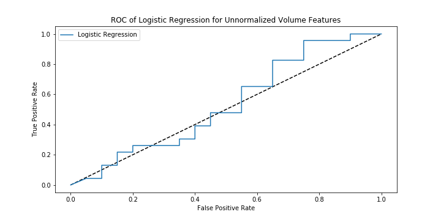
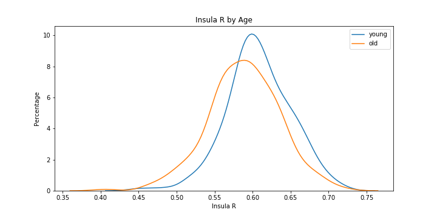

# Evaluation of the Predictive Capabilities of Select Brain Attributes for Sex and Age Group

Ariana Olson, Emma Price

## Overview

Researchers and social scientists alike have often wondered if there is a biological difference between "male" and "female" brains. Several studies, including [Sex beyond the genitalia: The human brain mosaic](https://www.pnas.org/content/112/50/15468) and [Multivariate revisit to “sex beyond the genitalia”](https://www.pnas.org/content/113/14/E1966) have used a system of looking into many brain features to try and answer this question and comparing between those male and female study participants, with conflicting results.

Both of the studies above include a dataset that utilizes the absolute volume of brain features in their mosaic analysis. Men are traditionally larger than women and that extends to the size of their brain. As such, it is fairly easy to spot a male brain given the absolute volume of different portions, but this does not necessarily indicate a difference between the brains.

We examined the predictive capabilities of brain volumes when they are normalized for the total brain volume and how those capabilities compare to the ability of normalized volume to predict a brain's age group -- looking specifically at people 25-49 and 49-60, which would be recognized in most work places as 'young' and 'old'. Given that a lot of gender disparity is made apparent in the workplace, but there is little age disparity in the workplace, this makes an interesting comparison.

We also explored the predictive abilities of brain region connectome, or the concentration of brain tissue in different areas. Specifically, whether connectomes were better at categorizing male and female brains, or early college-late college age groups (18-20 vs. 20-22).

We found that generally, there exist more drastic difference between male and female brains and, these specific portions of the mosaic are better at predicting sex based on the data than age group.

## Methods

### Data

#### Brain Volume (Gender vs. Age Predictability) -- Nathan Kline Institute Volume (NKI) Dataset

The NKI released a dataset containing the "volume of cortical and subcortical gray and white matter". This dataset contains volume and age information on 167 female and 100 male brains, collected from MRI scans. It specifically identifies 68 portions of the brain and provides information on each portion's volume.

We used all of this data to to understand the difference between brain genders and brain ages. From the first data set, we analyzed the brain gender difference in absolute and relative volumes (relative meaning that the volume of each brain portion has been divided by the total brain volume) as well as the differences in brain age groups. We broke the data test subjects into "old" and "young", or 49-60 and 26-49. 26 to 60 marked the interquartile range of ages for this dataset and 49 was the median. This mapped fairly well to the typical working age range. For both the gender and age groupings, we analyzed the Cohen Effect Size within each brain volume measurement to understand the difference between each brain group, then performed a logistic regression to get it's predictive power.

#### Brain Connectomes (Gender vs. Age Predictability) -- 1000 Connectomes project

The 1000 Connectomes Project has a dataset that analyzes the connectomes of a person's brain my measuring the "differences in local concentrations of brain tissue, through a voxel-wise comparison of multiple brain images." [https://en.wikipedia.org/wiki/Voxel-based_morphometry](Wikipedia). The values contained within this dataset indicate how connected a brain appears on an MRI.

We performed the same analyses in the connectomes dataset as in the NKI dataset; however, in that there was no one feature that all of the others were tied to. The connectomes dataset does range from 18-26 because the MRI collection was performed at University of North Carolina. As such, rather than look into age groups based on the common age range of working people, we looked at "upperclassmen" (older than 21) and "underclassmen" (younger than 21).

## Results

### Brain Volume

#### Absolute Volume and Sex
The Cohen Effect Size analysis of all volume-related variables between male and female brains found that the most different features had fairly large effect size. The 12 most different features are shown below with their Cohen Effect Sizes' and the average effect size.

| Feature                        | Cohen Effect Size |
|--------------------------------|-------------------|
| total_volume                   | 0.998091          |
| rh_superiorfrontal_volume      | 0.970546          |
| rh_inferiortemporal_volume     | 0.964111          |
| rh_lateraloccipital_volume     | 0.960110          |
| rh_precuneus_volume            | 0.958064          |
| lh_middletemporal_volume       | 0.953209          |
| lh_superiorfrontal_volume      | 0.941572          |
| lh_medialorbitofrontal_volume  | 0.937211          |
| rh_rostralmiddlefrontal_volume | 0.927699          |
| lh_inferiortemporal_volume     | 0.909025          |
| rh_fusiform_volume             | 0.890256          |
| rh_lateralorbitofrontal_volume | 0.874188          |
| average                        | 0.652060          |

Total volume was the most different, as expected, with a number of other portions close behind. The superior frontal lobe volume had the largest effect size between male and female brains -- a KDE plot of that value across both groups is shown below.

Which is quite similar to the distribution of total volume between men and women, indicating that they are likely related, as predicted.

We performed logistic regression with the absolute volume measurements and scored it in a number of ways to determine how well they could predict a male or female brain. This regression has an R2 of 0.671, it's prediction a Root Mean Squared Error (RMSE) of 0.574 and a ROC AUC Score of 0.722 -- ROC curve shown below.

#### Relative Volume and Sex
To determine how much the brain volumes differ between male and female outside of total volume, we looked at what percentage of the total brain is made up of the portion in question. The 12 largest Cohen Effects sizes between male and female of relative volumes are shown below, along with the average.

| Feature                             | Cohen Effect Size |
|-------------------------------------|-------------------|
| lh_middletemporal_volume_norm       | 0.416500          |
| rh_inferiortemporal_volume_norm     | 0.378245          |
| lh_rostralmiddlefrontal_volume_norm | 0.337220          |
| rh_rostralmiddlefrontal_volume_norm | 0.305688          |
| rh_middletemporal_volume_norm       | 0.300476          |
| lh_inferiortemporal_volume_norm     | 0.278646          |
| lh_medialorbitofrontal_volume_norm  | 0.259600          |
| rh_precuneus_volume_norm            | 0.249023          |
| lh_parsorbitalis_volume_norm        | 0.234720          |
| lh_supramarginal_volume_norm        | 0.205109          |
| rh_parsorbitalis_volume_norm        | 0.189739          |
| rh_inferiorparietal_volume_norm     | 0.184604          |
| average                             | -0.036110         |

The Middle Temporal Lobe now has the largest effect size between men and women, but it is less than half of the effect size of absolute volume. There is a pretty large overlap between the two male and female brains, shown in the distribution of this volume is below.

As a comparison, the superior frontal lobe (of which the absolute volume is shown above) is shown below as a distribution of the relative volume. There is a very large overlap between male and female brains on this relative volumes, further indicating that there is a connection between our volume variables and total volume.

To understand the predictive power relative volume, we performed another logistic regression of all of these relative volume features. In this regression, the R2 value is 0.646, the RMSE is 0.595, and the ROC AUC Score is 0.781 -- ROC curve of this is shown below.

#### Absolute Volume and Age
The 12 absolute volume features with the largest Cohen Effect sizes are shown below, where "young" has the larger mean. These effect sizes are smaller than the absolute volume effect size between male and female brains, but they are still reasonably large.

| Feature                        | Cohen Effect Size |
|--------------------------------|-------------------|
| rh_medialorbitofrontal_volume  | 0.761393          |
| lh_parstriangularis_volume     | 0.740418          |
| lh_lateralorbitofrontal_volume | 0.717843          |
| lh_rostralmiddlefrontal_volume | 0.712378          |
| rh_posteriorcingulate_volume   | 0.692557          |
| rh_inferiorparietal_volume     | 0.680425          |
| rh_parstriangularis_volume     | 0.661210          |
| rh_parsopercularis_volume      | 0.661119          |
| rh_superiorfrontal_volume      | 0.659108          |
| total_volume                   | 0.650822          |
| lh_middletemporal_volume       | 0.633724          |
| lh_parsopercularis_volume      | 0.630243          |
| average                        | 0.428908          |

A visual representation of the brain portion with the largest effect size is shown below.

The logistic regression to predict age group from these volume features performed quite poorly. The R2 value was 0.535, the RMSE was 0.682, and the ROC AUC score was 0.534. The ROC curve shown below depicts a curve that is almost inverse, indicating that it would be easier to just guess than use a logistic regression model.

#### Relative Volume and Age
Within the "young" and "old" age groups, there was as well generally a smaller effect size when looking at the volume of a brain portion relative to the total brain volume. These effect sizes were on average smaller than their gender group counterpart, indicating that there is a larger different between gender groups than age groups when it comes to relative brain volumes. The top 12 Cohen Effect Size are shown below.

| Feature                             | Cohen Effect Size |
|-------------------------------------|-------------------|
| lh_rostralmiddlefrontal_volume_norm | 0.475797          |
| lh_parstriangularis_volume_norm     | 0.404769          |
| rh_parsopercularis_volume_norm      | 0.342945          |
| rh_transversetemporal_volume_norm   | 0.319506          |
| rh_parstriangularis_volume_norm     | 0.311488          |
| rh_inferiorparietal_volume_norm     | 0.301266          |
| lh_middletemporal_volume_norm       | 0.300623          |
| rh_posteriorcingulate_volume_norm   | 0.299719          |
| rh_bankssts_volume_norm             | 0.296518          |
| lh_parsopercularis_volume_norm      | 0.234782          |
| lh_caudalmiddlefrontal_volume_norm  | 0.228521          |
| lh_lateralorbitofrontal_volume_norm | 0.225363          |
| average                             | -0.009188         |

The logistic regression of relative volume performed equally as poorly in determining age groups as the absolute volume logistic regression, with a ROC curve that is worse than guessing.

### Connectomes

#### Connectomes and Sex
To understand how different connectomes are between male and female brains, we measured the Cohen Effect size of each identified sections, of which there are 118. The connectomes depict a much stronger effect size than relative volume, where female brain consistently have more. The average, 12 largest are shown below.

| Feature           | Cohen Effect Size |
|-------------------|-------------------|
| vermis_7          | 0.601494          |
| hippocampus_r     | 0.576675          |
| caudate_l         | 0.537445          |
| cerebelum_crus2_r | 0.503056          |
| postcentral_r     | 0.488203          |
| hippocampus_l     | 0.462809          |
| frontal_inf_orb_l | 0.456477          |
| frontal_sup_orb_l | 0.455499          |
| cerebelum_crus2_l | 0.449714          |
| parietal_inf_r    | 0.429542          |
| postcentral_l     | 0.427087          |
| frontal_mid_orb_l | 0.425625          |
| average           | 0.247782          |

The distribution of `vermis_7` is shown below, depicting a smaller overlap compared to relative volume.

The logistic regression model that attempts to break up participants into male and female based on the connectomes in the brain. This model had an R2 value of 0.628, an RSME 0.610, and a ROC AUC score of 0.727. The ROC Curve is shown below.

#### Connectomes and Age

After splitting the data into under and over 21, we calculated the Cohen Effect size between the "upperclassmen" and "underclassmen" across the different connecomes features. The 12 largest are shown below.

| Feature         | Cohen Effect Size |
|-----------------|-------------------|
| insula_r        | 0.436826          |
| precentral_r    | 0.410753          |
| insula_l        | 0.374693          |
| frontal_mid_r   | 0.372729          |
| temporal_inf_r  | 0.359378          |
| temporal_mid_r  | 0.341947          |
| frontal_mid_l   | 0.339900          |
| parietal_inf_r  | 0.336717          |
| rolandic_oper_r | 0.332593          |
| fusiform_r      | 0.326248          |
| heschl_r        | 0.323768          |
| olfactory_r     | 0.320996          |
| average         | 0.184161          |

The largest Cohen Effect size between "upperclassmen" and "underclassmen" is the insula_r, of which the distribution between male and female is shown below.

The logistic regression of age performed better than the relative or absolute volumes, but still not as well as the connectomes sex. The R2 value was 0.521, the RMSE was 0.692, and the ROC AUC score was 0.5644. The ROC curve is shown below.

## Interpretation

Our results summary is shown below.

| Data Set         | Attributes      | Sex v. Age | Max Cohen Effect | Average Cohen Effect | R^2   | RMSE  | ROC AUC Score |
|------------------|-----------------|------------|------------------|----------------------|-------|-------|---------------|
| NKI              | Absolute Volume | Sex        | 0.998091         | 0.652060             | 0.671 | 0.574 | 0.722         |
|                  |                 | Age        | 0.761393         | 0.428908             | 0.535 | 0.682 | 0.534         |
|                  | Relative Volume | Sex        | 0.416500         | -0.036110            | 0.646 | 0.595 | 0.781         |
|                  |                 | Age        | 0.475797         | -0.009188            | 0.535 | 0.682 | 0.534         |
| 1000 Connectomes | Connectomes     | Sex        | 0.601494         | 0.247782             | 0.628 | 0.610 | 0.727         |
|                  |                 | Age        | 0.436826         | 0.184161             | 0.521 | 0.692 | 0.564         |

This summary allows for easier comparison, specifically across age and sex features. Across the board, the differences between male and female brains is more drastic than that of age, though at times, neither are particularly drastic at all. As well, the logistic regression that was classifying by sex also have better performance across the board compared to age.

Based on the comparison between relative and absolute volumes with in the first data set, it does appear that volume features are tied to the smaller volumes -- a tie that worsened the predictive power of the data. This is likely to the effect that total volume had on all of the individual volumes. Doing a logistic regression where all of the volumes are features is essentially like doing a logistic regression of just total volume because each feature is heavily determined by that one feature. When we made each portion volume relative, a lot of the information that was clouding the features was uncovered, which improved the regression.

Of course, whether or not a brain has bigger sections or more connectomes does not indicate and professional, academic, intelligence, etc. differences between male and female brains. Physical differences to do necessarily change the ability that a brain has to do its job.
